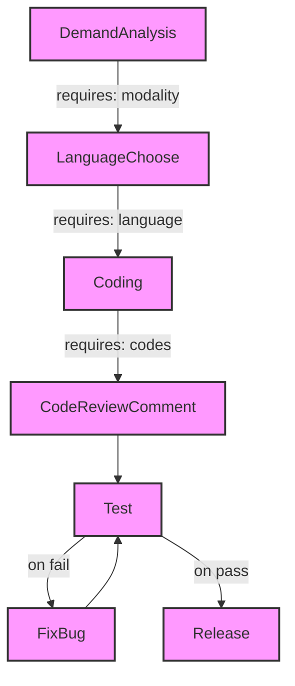
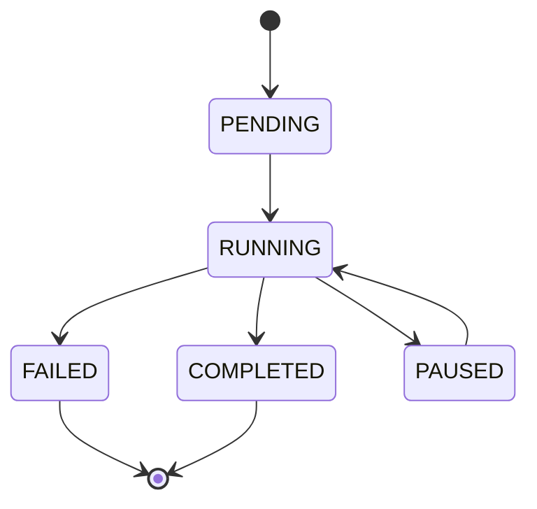
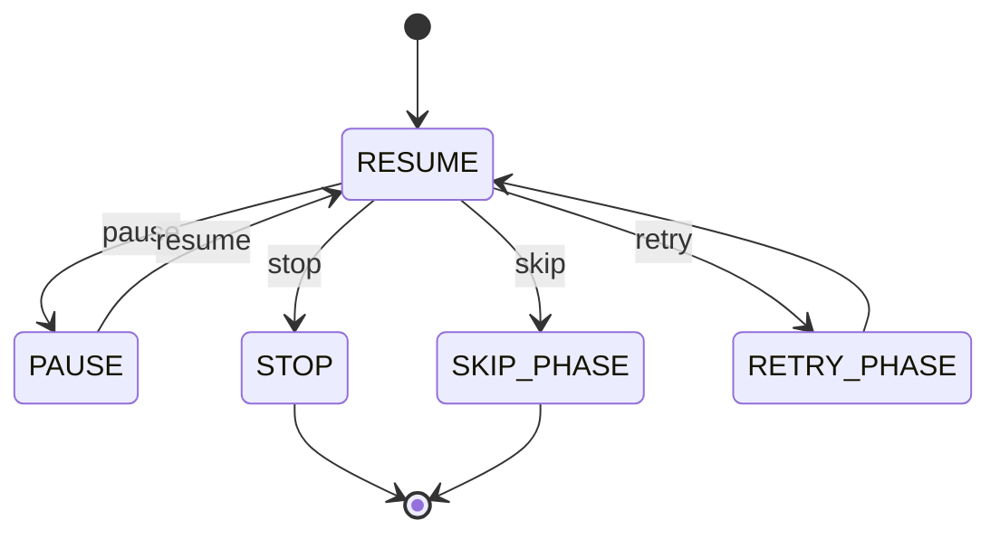

# ChatDev Phase Transitions

This document visualizes the phase transitions and their requirements in the ChatDev framework.

## Phase Transition Graph



## Phase Requirements

### DemandAnalysis
- **Status**: Must be COMPLETED
- **Required Artifacts**: 
  - `modality`: string (non-empty)
- **Valid Transitions**: → LanguageChoose

### LanguageChoose
- **Status**: Must be COMPLETED
- **Required Artifacts**:
  - `language`: string (non-empty)
- **Valid Transitions**: → Coding

### Coding
- **Status**: Must be COMPLETED
- **Required Artifacts**:
  - `codes`: dictionary (non-empty)
- **Valid Transitions**: → CodeReviewComment

### CodeReviewComment
- **Status**: Must be COMPLETED
- **Required Artifacts**: None
- **Valid Transitions**: → Test

### Test
- **Status**: Must be COMPLETED
- **Required Artifacts**: None
- **Valid Transitions**: 
  - → Release (on pass)
  - → FixBug (on fail)

### FixBug
- **Status**: Must be COMPLETED
- **Required Artifacts**: None
- **Valid Transitions**: → Test

### Release
- **Status**: Must be COMPLETED
- **Required Artifacts**: None
- **Valid Transitions**: None (terminal state)

## Phase States



## Control Actions



## API Endpoints

### Status and Control
- `GET /supervisor/status` - Get current phase status
- `GET /supervisor/events` - Get recent events
- `POST /supervisor/control/{action}` - Control execution
- `POST /supervisor/inject` - Inject guidance

### Transitions
- `GET /supervisor/transitions` - List valid transitions
- `POST /supervisor/transition/{to_phase}` - Validate transition

## Example Usage

```bash
# Get current status
curl http://localhost:8001/supervisor/status

# List valid transitions
curl http://localhost:8001/supervisor/transitions

# Validate transition to Coding phase
curl -X POST http://localhost:8001/supervisor/transition/Coding

# Inject guidance
curl -X POST http://localhost:8001/supervisor/inject \
  -H "Content-Type: application/json" \
  -d '{"phase": "Coding", "guidance": "Add error handling", "priority": 1}'

# Control execution
curl -X POST http://localhost:8001/supervisor/control/pause
curl -X POST http://localhost:8001/supervisor/control/resume
```
